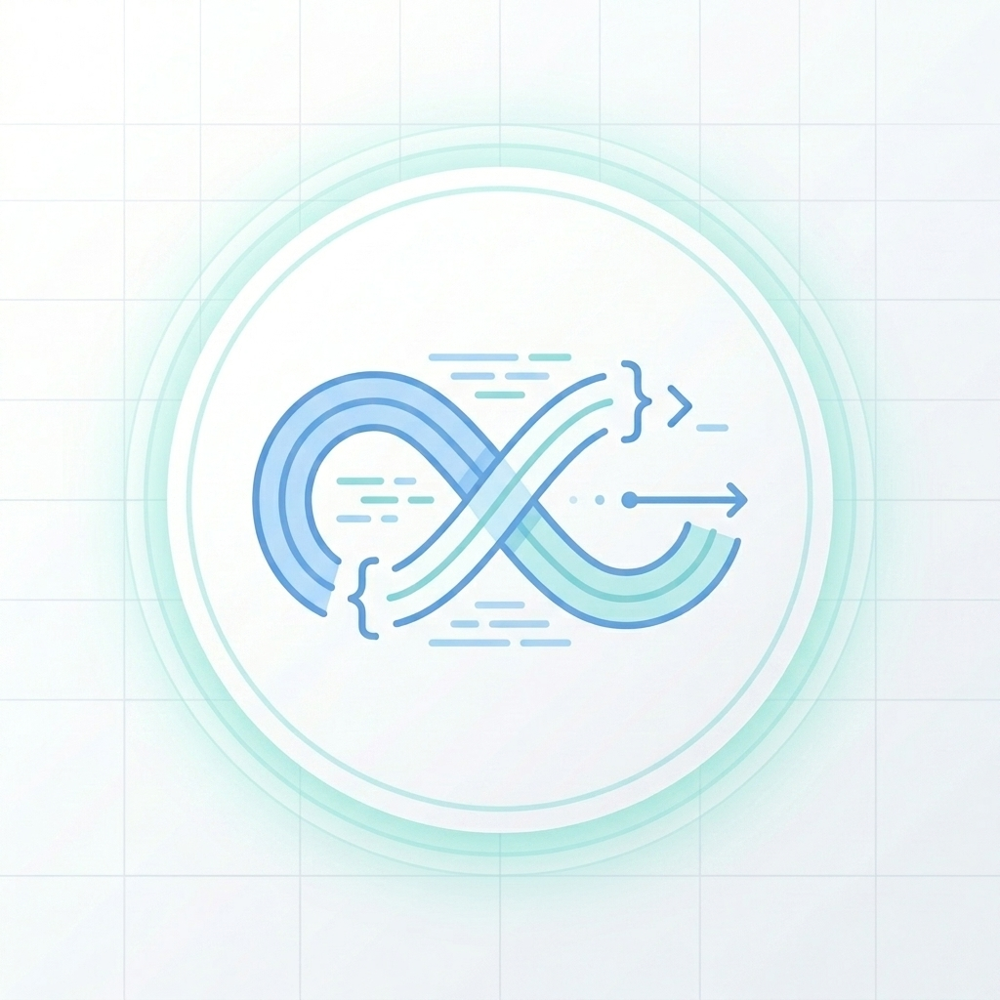

# Realm

<p align="center">
  
</p>

**Decision capture pipeline for Claude Code, Cursor, Codex, and Gemini.** Persists the WHY behind your code — decisions made, alternatives rejected, constraints imposed — as interlinked ADR nodes in an Obsidian vault.

---

## Table of Contents

- [What is Realm?](#what-is-realm)
- [Why Realm?](#why-realm)
- [How It Works](#how-it-works)
- [Skills](#skills)
- [Installation](#installation)
- [Uninstallation](#uninstallation)
- [Quick Start](#quick-start)
- [Querying the Vault](#querying-the-vault)
- [Token Economics](#token-economics)
- [Vault Structure](#vault-structure)
- [Local Pipeline State](#local-pipeline-state)
- [Guards](#guards)
- [Dependencies](#dependencies)

---

## What is Realm?

Realm is an AI-coding-host skill/plugin that captures architectural decisions as you make them — the choices, the alternatives you rejected, and the constraints those decisions impose — and stores them as compressed, interlinked ADR nodes in an Obsidian vault.

Every new AI session starts cold. Code tells Claude *what* exists. Realm tells Claude *why* it exists that way, what was tried and discarded, and what must not change.

---

## Why Realm?

Code captures the surviving solution. It does not capture the graveyard of rejected alternatives, the constraint that forced an unusual pattern, or the incident that made you write "DO NOT change this order."

Without a decision record, AI assistants re-derive or re-propose settled questions every session. You answer the same "why not Redis pub/sub?" question repeatedly. A rejected approach gets proposed again in session 12.

| Problem | Realm's Answer |
|---------|----------------|
| AI starts cold every session | Vault persists decisions across sessions |
| Code doesn't explain WHY | ADR nodes store rationale + rejected alternatives |
| Rejected approaches get re-proposed | `realm-recall "tried X"` surfaces prior art instantly |
| Constraints are invisible in code | Consequences field captures what must not change |

Realm is not a documentation generator. It is a decision memory layer between your conversations and your AI assistant.

---

## How It Works

### 1. Capture — realm-convey

At the end of a session where a decision was made, run `/realm-convey`. It:

1. Compresses the conversation and extracts decisions and discoveries
2. Runs a structured ADR interview for each decision:
   - What was decided?
   - What alternatives were rejected and why?
   - What constraints does this impose?
   - What triggered this?
3. Writes a staged `manifest-draft.md` — no vault writes yet

No codebase scan. No investigator swarm. Decisions already exist in the conversation.

### 2. Commit — realm-manifest

Review the staged draft, then `/realm-manifest` writes ADR nodes to the vault, generates backlinks, and archives the draft.

```
/realm-forge      ← once per project: bootstrap vault + local state
/realm-convey     ← extract decisions from conversation → staged draft
/realm-manifest   ← write ADR nodes → vault
```

If any node in the draft targets a file that already exists, realm-manifest surfaces the conflict before writing:

```
realm-manifest: existing vault files detected

  plans/online-book-reader:
    CONFLICT: decisions/ADR-007-book-reader.md

  Overwrite existing files? (y/n):
```

`y` → overwrite. `n` → cancel, vault unchanged. Existing nodes are only touched with explicit confirmation.

### 3. Query — realm-recall

```bash
/realm-recall "why JWT"               # ~20 tokens
/realm-recall "what was rejected for auth"   # surfaces rejected_alternatives
/realm-recall "constraint on payments"       # consequences field
/realm-recall "has anyone tried websockets"  # scans rejected paths across all ADRs
/realm-recall decisions               # all ADR nodes, compressed
```

### 4. Investigate — realm-fathom

Before touching unfamiliar code:

```bash
/realm-fathom function:validateUser   # live code (ground truth) + vault WHY
/realm-fathom "how does auth flow"    # end-to-end + ADR context
```

Live code is always ground truth. Vault adds the architectural intent. Conflicts flagged as `VAULT DRIFT`.

### 5. Plan — realm-plan

Think, research, and design in a persistent canvas before building. Saves to vault `work/` dirs. Finalizes to vault nodes when ready.

```bash
/realm-plan design "API versioning strategy"
/realm-plan deep-research->design->plan "auth refactor"
/realm-plan resume plans/auth-refactor
```

After finalizing, run `/realm-convey` to capture any decisions the planning session produced as ADR nodes.

See [VISUALS.md](VISUALS.md) for pipeline flow diagrams.

---

## Skills

| Skill | Purpose |
|-------|---------|
| `/realm-forge` | Bootstrap vault directory structure and local state. Run once per project. |
| `/realm-convey` | Extract decisions and discoveries from the current conversation. Structured ADR interview per decision. Writes staged manifest-draft — no codebase scan. |
| `/realm-manifest` | Write staged draft to vault, generate backlinks, archive draft, update doc registry. Detects conflicts before writing — prompts to overwrite if a target node already exists. |
| `/realm-recall` | Query vault by decision keyword, tag, or semantic phrase. Optimized for ADR queries: "why X", "rejected for Y", "constraint on Z". |
| `/realm-fathom` | Deep investigation: live code + vault in parallel. Returns what (code) + why (vault). Flags drift. Zero writes. |
| `/realm-plan` | Free-form ideation canvas. Chain syntax defines generation order. Categorized `work/` persistence. Resume across sessions. Finalizes to vault nodes. |
| `/realm-status` | Read-only health check. Lists node counts, stale docs, pipeline state. |

---

## Installation

See [REQUIREMENTS.md](REQUIREMENTS.md) for prerequisites.

### Codex, Cursor, and Gemini

```bash
# Recommended installer
curl -fsSL https://raw.githubusercontent.com/blackmo18/realm/main/install.sh | bash -s -- --agent codex
curl -fsSL https://raw.githubusercontent.com/blackmo18/realm/main/install.sh | bash -s -- --agent cursor
curl -fsSL https://raw.githubusercontent.com/blackmo18/realm/main/install.sh | bash -s -- --agent gemini

# Skills-only direct installs
npx skills add blackmo18/realm -a codex
npx skills add blackmo18/realm -a cursor
npx skills add blackmo18/realm -a gemini
```

From a local clone:

```bash
node bin/install.js --agent codex
```

After install, restart your host or open a new session, then run:

```bash
/realm-forge
```

### Claude Code

```bash
# 1. Install caveman plugin (required dependency)
/plugin marketplace add ~/.claude/plugins/marketplaces/caveman

# 2. Copy Realm into the Claude plugin marketplace path from a local clone
node bin/install.js --agent claude --force

# 3. Install realm
/plugin marketplace add ~/.claude/plugins/marketplaces/realm
```

Full step-by-step guide: [INSTALL.md](INSTALL.md)

---

## Uninstallation

```bash
# Skills CLI installs (Cursor, Codex, Gemini)
npx skills remove realm
```

For Claude Code installs:

```bash
# Automated uninstall (recommended)
./uninstall.sh

# Or manually
rm -rf ~/.claude/plugins/marketplaces/realm
rm -rf ~/.claude/plugins/marketplaces/caveman
```

Full uninstall guide: [UNINSTALL.md](UNINSTALL.md)

---

## Quick Start

```bash
# 1. Bootstrap the vault for your project
/realm-forge

# 2. After a session where you made a decision, capture it
/realm-convey

# 3. Review .realm/manifest-draft.md, then write to vault
/realm-manifest

# 4. Query anytime
/realm-recall "why JWT"
/realm-recall decisions
/realm-status
```

---

## Querying the Vault

### Decision queries (primary use case)

```bash
/realm-recall "why did we choose X"       # rationale field
/realm-recall "what was rejected for Y"   # rejected_alternatives field
/realm-recall "constraint on Z"           # consequences field
/realm-recall "has anyone tried W"        # scan rejected paths across all ADRs
/realm-recall decisions                   # all ADR nodes, compressed
/realm-recall decisions --full            # full prose including context + rejected
```

### Before touching unfamiliar code

```bash
/realm-fathom function:validateUser       # signature, flow, callers + vault why + drift check
/realm-fathom class:AuthService           # class responsibility + vault ADR context
/realm-fathom "how does auth flow work"   # freeform → relevant code mapped + vault decisions
```

Use `realm-fathom` before modifying unfamiliar code. Live code is ground truth; vault adds the decisions that shaped it. Conflicts are flagged as `VAULT DRIFT`.

### By tag

```bash
/realm-recall @auth                       # all #auth nodes
/realm-recall @auth --trace               # link tree only (<10 tokens)
/realm-recall @auth --count               # token estimate before pulling
```

---

## Token Economics

### What realm-recall saves

| Question | Without vault | With realm-recall | Savings |
|----------|--------------|-------------------|---------|
| "Why did we choose JWT?" | 500–2K tokens (multi-file + reasoning) | ~20 tokens | 97% |
| "What was rejected for auth?" | Cannot answer without docs | ~30 tokens | — |
| "Any constraint on payment module?" | Cannot answer without docs | ~25 tokens | — |
| "Has anyone tried websockets?" | Cannot answer without docs | ~20 tokens | — |
| All decisions in project | — | ~20 tokens/node | — |

### Capture cost

| Action | Cost |
|--------|------|
| `/realm-convey` (1–3 decisions) | ~1–3K tokens (interview inline, no scan) |
| `/realm-manifest` (write nodes) | ~500 tokens (script-driven) |
| `/realm-recall` (query) | ~20–200 tokens depending on result size |

A decision captured once pays off on the second query. No break-even math needed.

---

## Vault Structure

```
<vault>/projects/<slug>/
├── overview.md          # status, stack, milestone tracker, key file links
├── architecture.md      # service map, event shapes, data flow, schema groups
├── decisions/
│   ├── ADR-000-index.md # table of all ADRs
│   └── <id>.md          # one file per decision
├── discoveries/
│   └── YYYY-MM-DD-<topic>.md  # perf notes, bug discoveries, unexpected findings
├── sessions/
│   └── YYYY-MM-DD-<topic>.md  # per-session logs
└── work/                      # in-progress realm-plan canvases
    ├── index.md
    ├── plans/
    ├── designs/
    ├── research/
    └── scaffolds/
```

**Node types:**

| Type | Directory | Content |
|------|-----------|---------|
| `decision` | `decisions/` | Context, decision, rejected alternatives, consequences, implementations |
| `discovery` | `discoveries/` | Findings, perf data, bug post-mortems, unexpected constraints |
| session log | `sessions/` | What was decided/discovered per session |
| work canvas | `work/<category>/` | In-progress ideation — promoted to real nodes on `finalize` |

Each ADR node structure:

```markdown
---
id: auth-jwt-choice
type: decision
tags: [auth, security]
---

# Auth: chose JWT over session cookies

Compressed: JWT chosen over session cookies; stateless scaling requirement; cookie approach rejected for multi-region session sync cost.

## Context
Mobile app requires stateless auth across 3 regions. Session sync cost was prohibitive.

## Decision
Use JWT with 15-min expiry + refresh token rotation.

## Rejected alternatives
- Session cookies: requires shared session store across regions → O(n) sync cost
- Opaque tokens: requires DB lookup on every request → latency unacceptable at scale

## Consequences
- Token revocation requires token blocklist (implemented in Redis)
- Refresh token rotation is MANDATORY — do not remove without re-evaluating revocation strategy
```

---

## Local Pipeline State

```
<project-root>/.realm/
├── realm-state.json        # doc registry + pipeline state
├── manifest-draft.md       # staged draft (convey → manifest)
└── archive/
    └── <timestamp>-draft.md  # past drafts after each manifest run
```

`.realm/` is added to `.gitignore` by `realm-forge`. Local state, not repo state.

---

## Guards

| Condition | Blocked skill | Message | Fix |
|-----------|--------------|---------|-----|
| `.realm/realm-state.json` missing | `realm-convey` | `No realm state found. Run /realm-forge first.` | `/realm-forge` |
| `phase.draftReady != true` | `realm-manifest` | `No staged draft. Run /realm-convey first.` | `/realm-convey` |
| `manifest-draft.md` missing | `realm-manifest` | `Draft file missing. Run /realm-convey to regenerate.` | `/realm-convey` |
| Draft targets existing file | `realm-manifest` | `CONFLICT: <path>` — prompts `Overwrite? (y/n)` | Reply `y` to overwrite, `n` to cancel |
| No vault nodes | `realm-recall` | `No nodes in vault yet.` | `/realm-convey` then `/realm-manifest` |

---

## Dependencies

### Required

| Dependency | Purpose |
|---|---|
| Supported host: Claude Code, Cursor, Codex, or Gemini | Runtime for Realm skills |
| Node.js with `npx` | Installs Realm for Cursor, Codex, and Gemini |
| [Obsidian](https://obsidian.md) 1.x+ | Vault storage, graph view, backlinks, tag pane |

### Plugin dependencies

Realm depends on the **caveman** plugin:

| Skill | Used by | Purpose |
|-------|---------|---------|
| `cavecrew-investigator` agent | `realm-fathom`, `realm-plan` | Live code investigation; outputs caveman-compressed findings |

Install caveman first for Claude Code:

```bash
/plugin marketplace add ~/.claude/plugins/marketplaces/caveman
```

### Optional Obsidian plugins

| Plugin | Purpose |
|---|---|
| Dataview | Query nodes by tag, type, or date |
| Graph Analysis | Enhanced backlink traversal |
| Templater | Use vault templates created by realm-forge |

---

**Diagrams:** [VISUALS.md](VISUALS.md) — pipeline flows, vault graph, guards, handoff state
