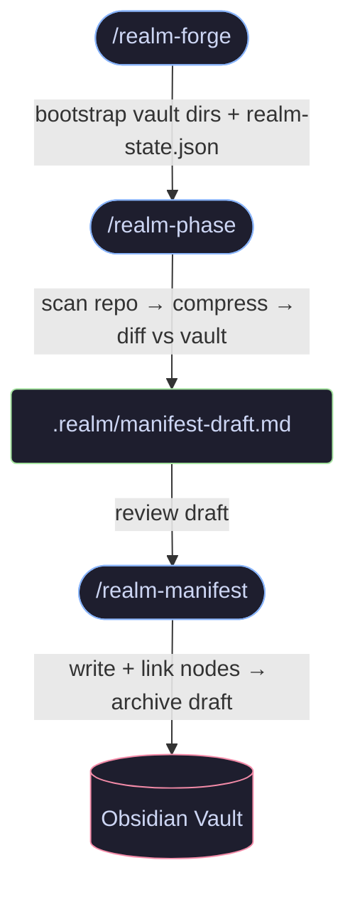
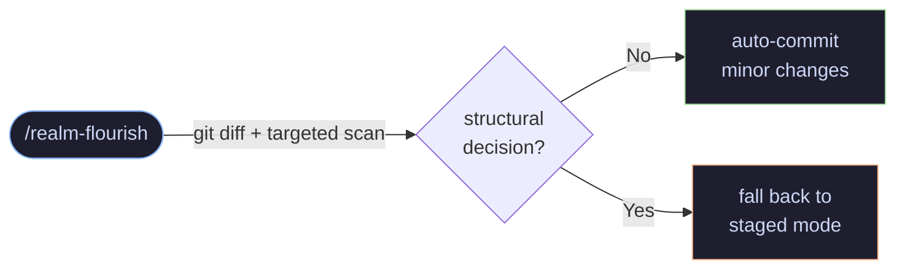
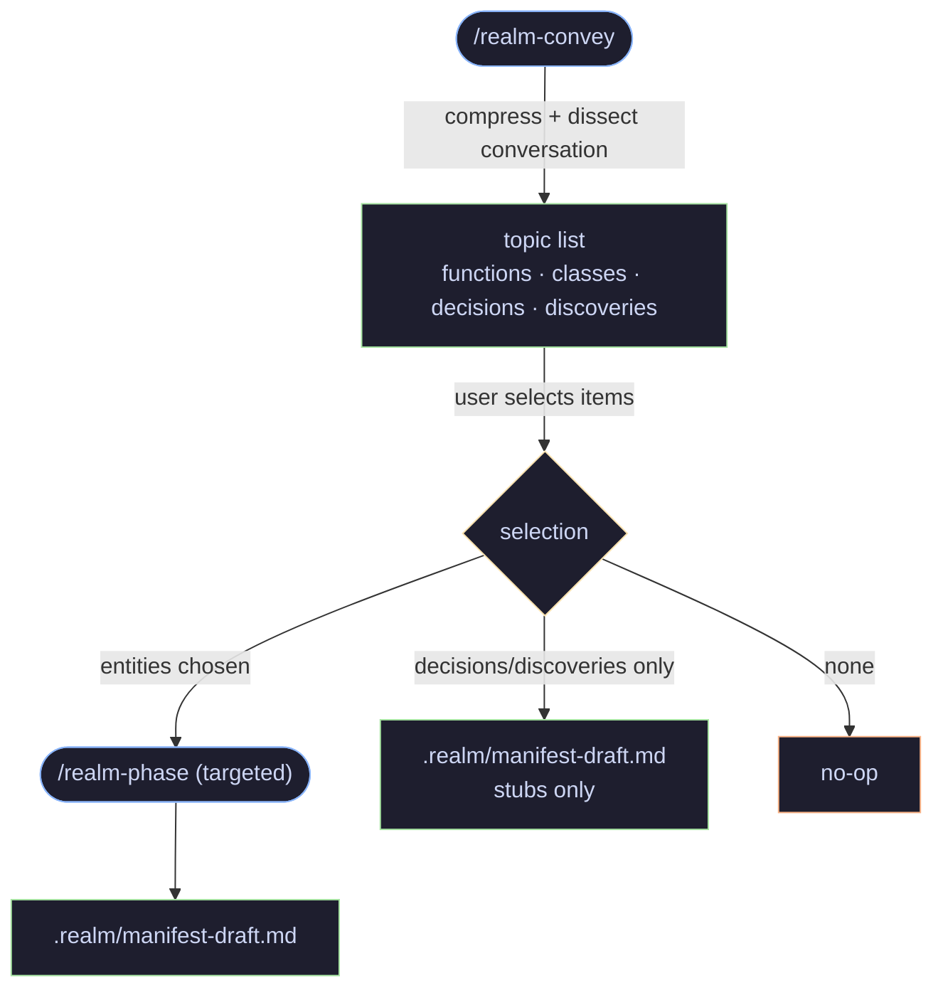
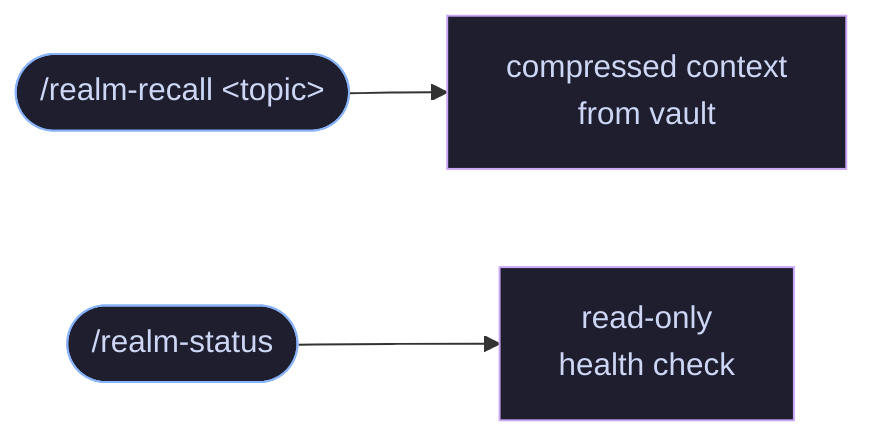
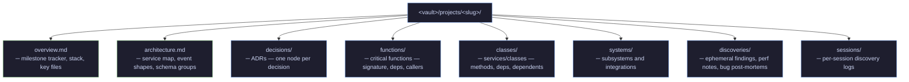
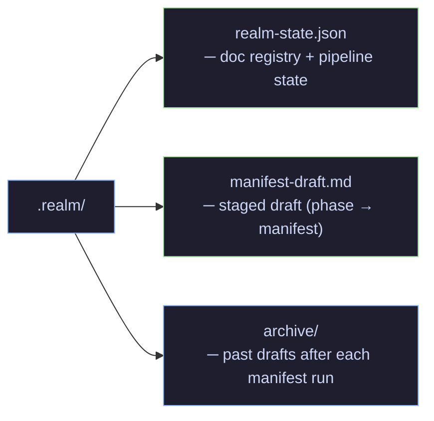
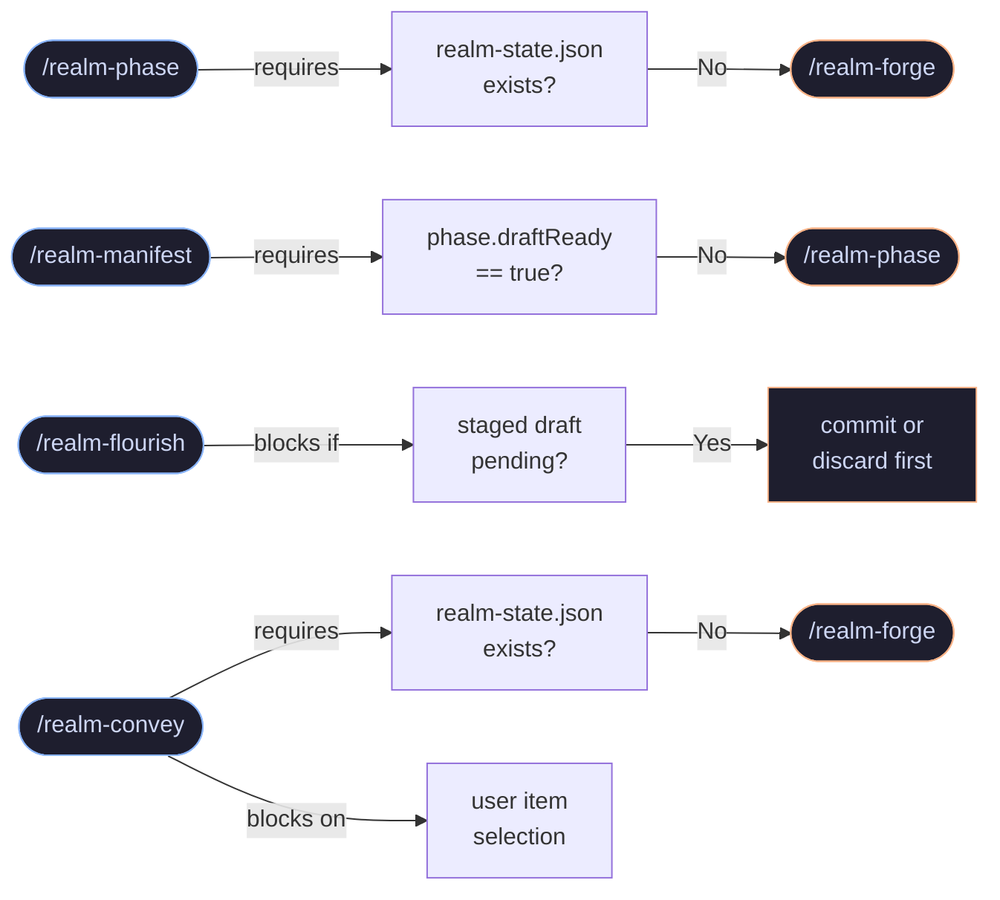

# Realm — Visual Reference

Pipeline flows, vault structure, and guard logic for [Realm](README.md).

---

## Table of Contents

- [Core Pipeline](#core-pipeline)
- [Incremental Update](#incremental-update)
- [Conversation Capture](#conversation-capture)
- [Queries](#queries)
- [Vault Structure](#vault-structure)
- [Local Pipeline State (.realm/)](#local-pipeline-state-realm)
- [Guards](#guards)

---

## Core Pipeline

Full pipeline from bootstrap to vault:

> No vault writes at phase time — review the draft before committing.

---

## Incremental Update

Quick sync after small code changes:

---

## Conversation Capture

Compress a conversation and route selected topics to the vault:

---

## Queries

Read-only skills — no pipeline state required:

---

## Vault Structure

---

## Local Pipeline State (.realm/)

`.realm/` is added to `.gitignore` by realm-forge. Local state, not repo state.

---

## Guards

Prerequisite checks enforced by each skill:

