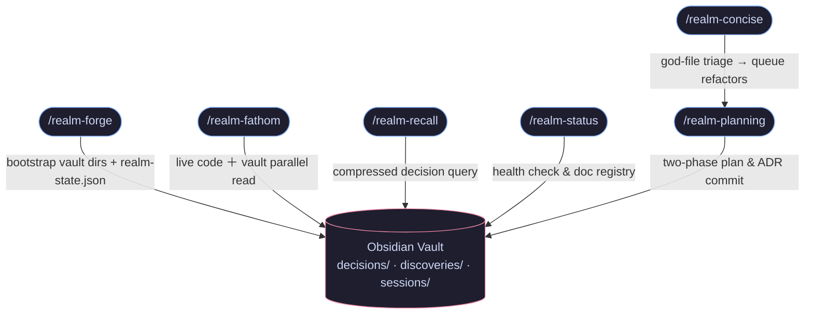
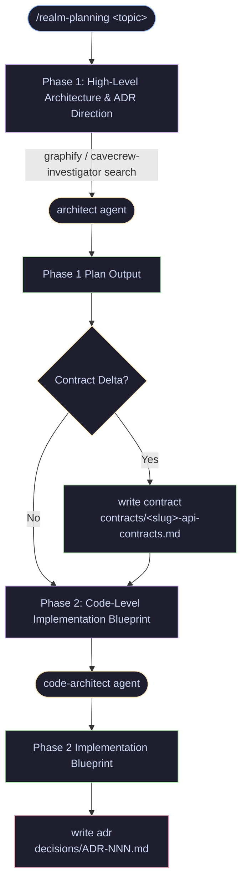
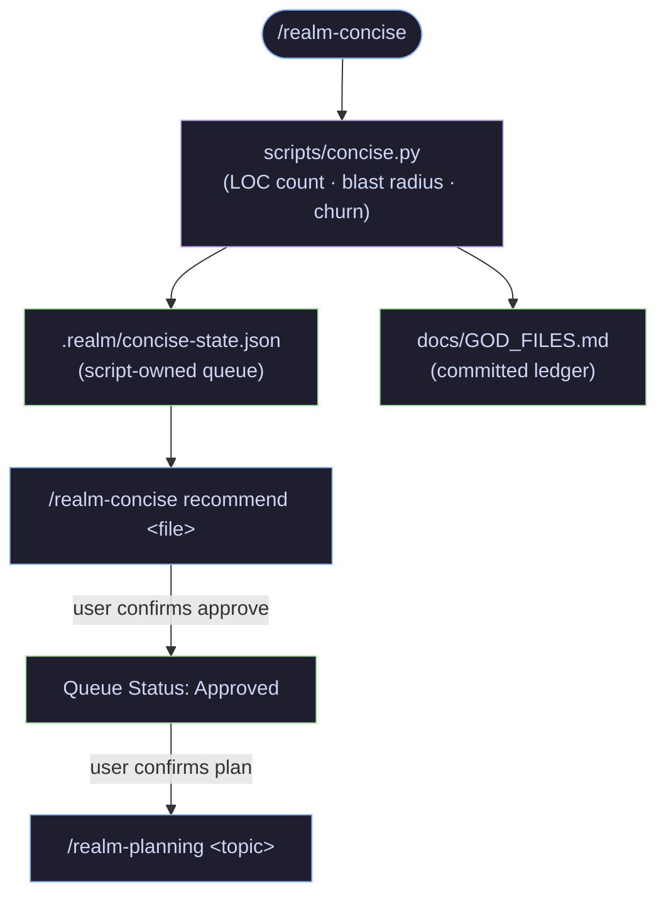
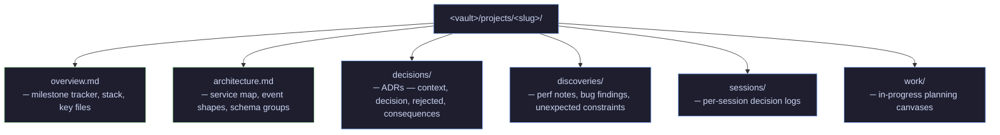
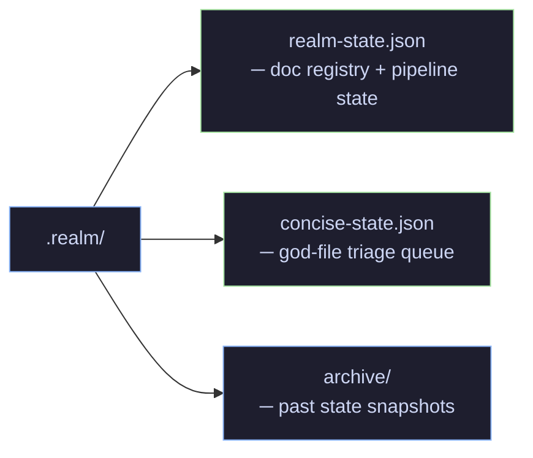
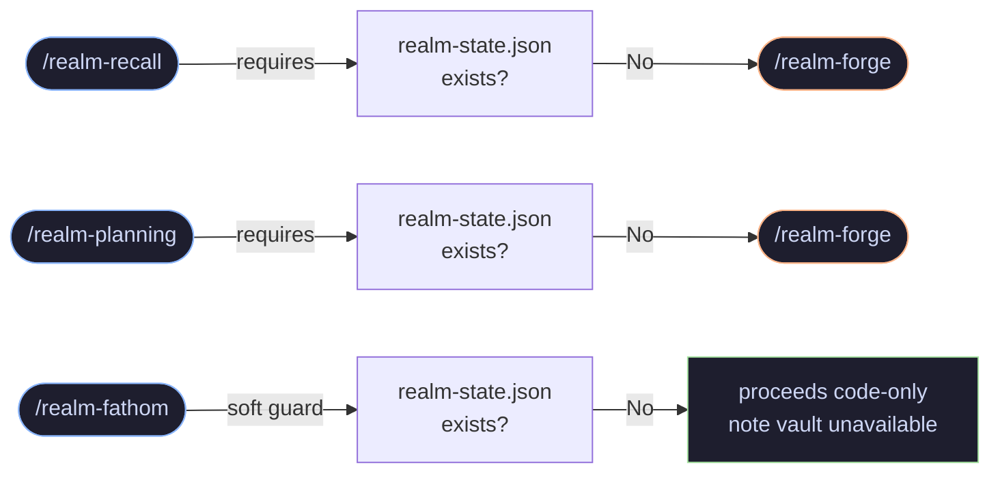

# Realm — Visual Reference

Pipeline flows, vault structure, and guard logic for [Realm](README.md).

---

## Table of Contents

- [Core Pipeline](#core-pipeline)
- [Two-Phase Planning (realm-planning)](#two-phase-planning-realm-planning)
- [God-File Triage (realm-concise)](#god-file-triage-realm-concise)
- [Queries & Fathom Investigation](#queries--fathom-investigation)
- [Vault Structure](#vault-structure)
- [Local Pipeline State (.realm/)](#local-pipeline-state-realm)
- [Guards](#guards)

---

## Core Pipeline

Decision memory & knowledge flow from AI host to Obsidian vault:

---

## Two-Phase Planning (realm-planning)

Structured planning operating inside native plan mode:

---

## God-File Triage (realm-concise)

Deterministic crawler finds oversized files, scores blast radius, and manages queue:

---

## Queries & Fathom Investigation

Read-only skills — no state mutation required:

### Fathom Investigation Flow

---

## Vault Structure

---

## Local Pipeline State (.realm/)

`.realm/` is added to `.gitignore` by `realm-forge`. Local state, not repo state.

---

## Guards

Prerequisite checks enforced by each skill:

