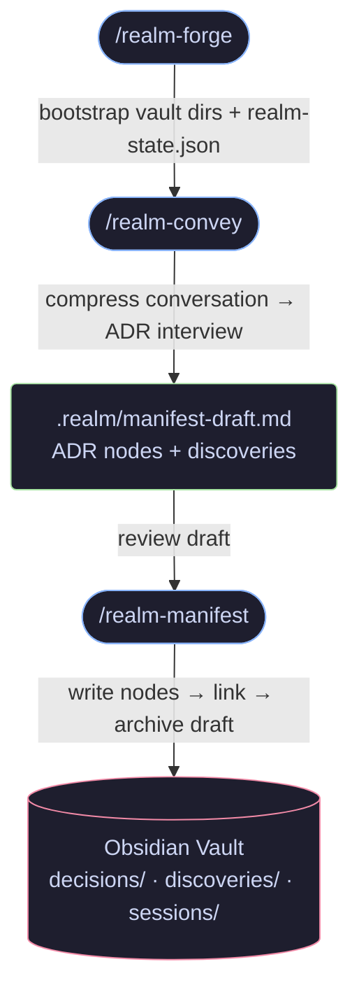
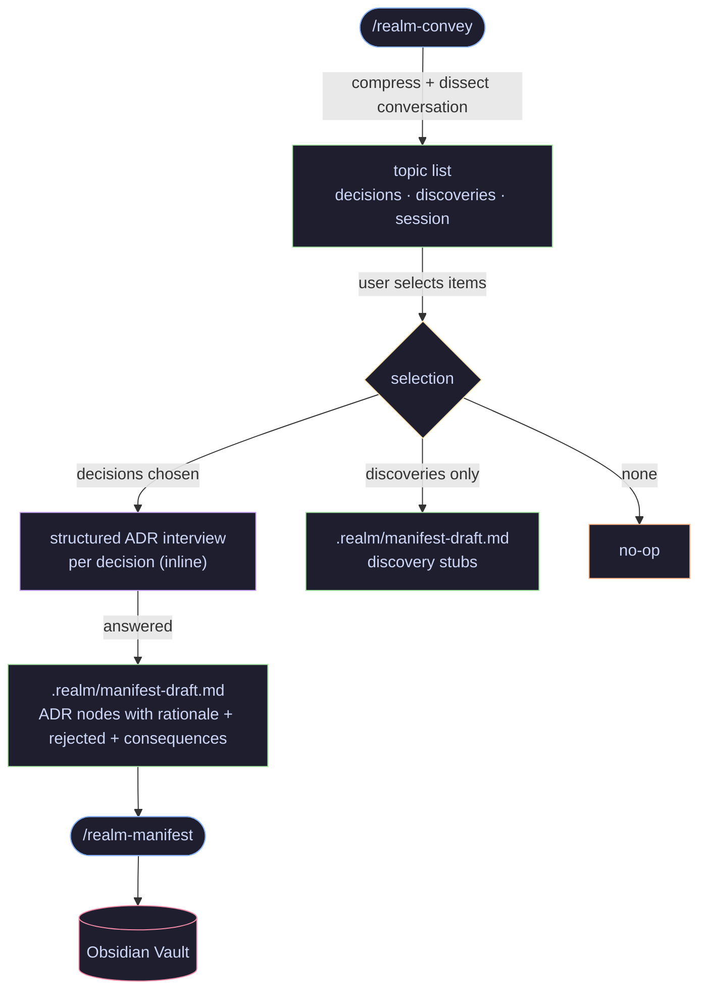
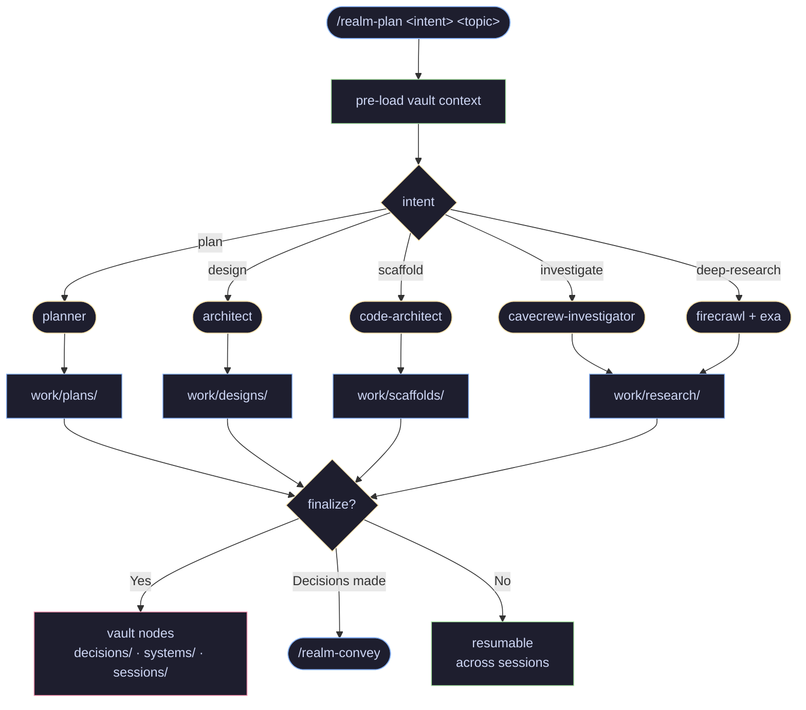
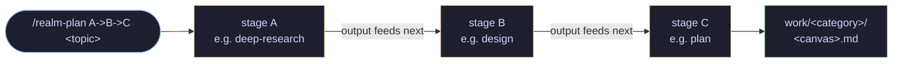
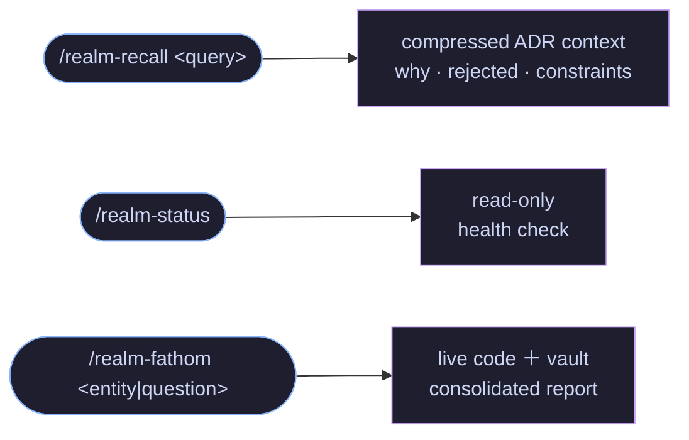
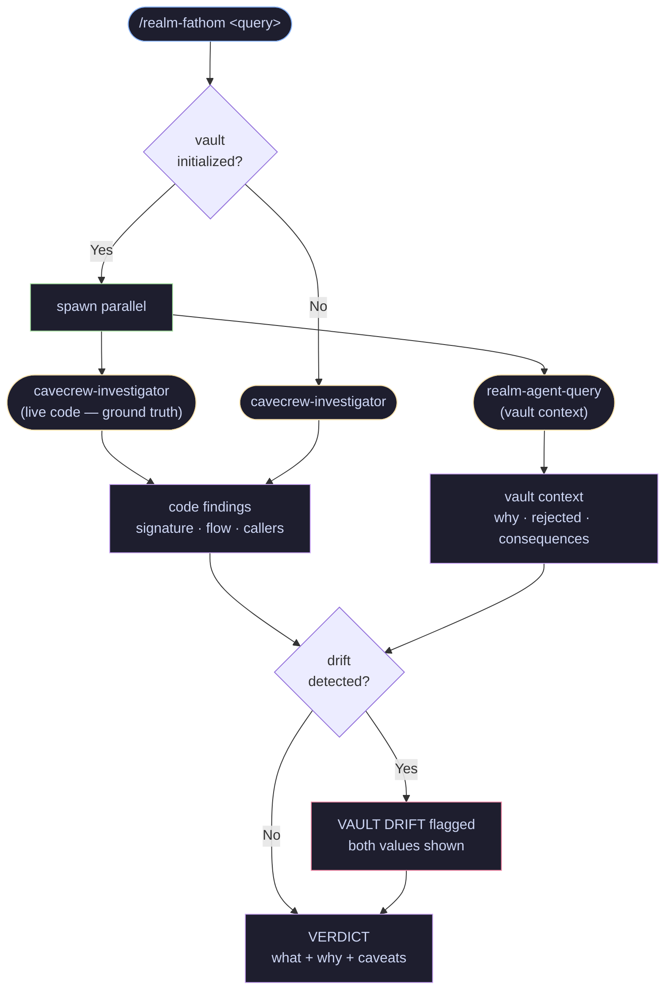
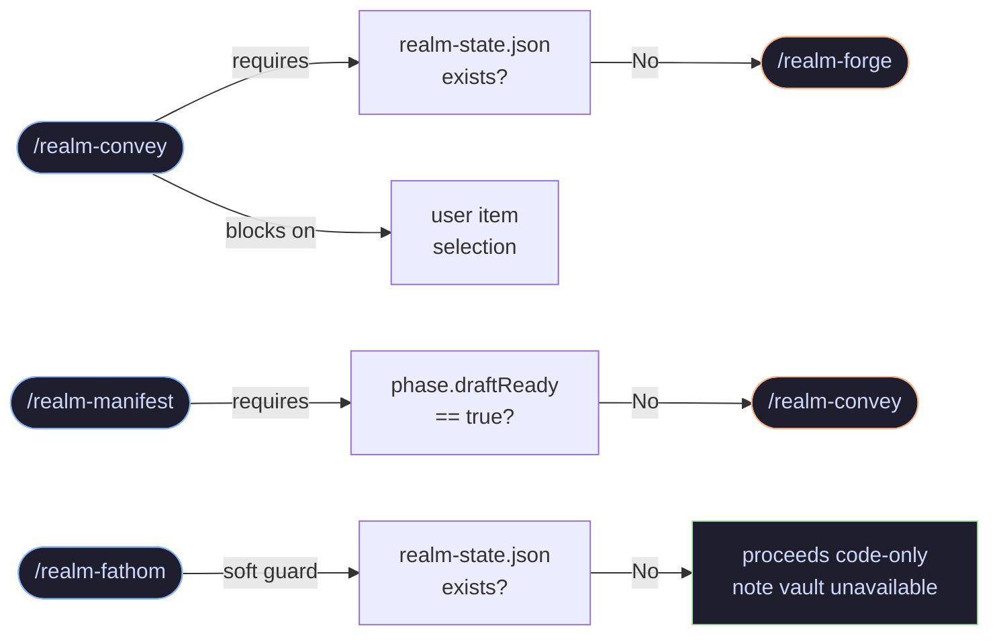

# Realm — Visual Reference

Pipeline flows, vault structure, and guard logic for [Realm](README.md).

---

## Table of Contents

- [Core Pipeline](#core-pipeline)
- [Conversation Capture (realm-convey)](#conversation-capture-realm-convey)
- [Ideation Canvas (realm-plan)](#ideation-canvas-realm-plan)
- [Queries](#queries)
- [Vault Structure](#vault-structure)
- [Local Pipeline State (.realm/)](#local-pipeline-state-realm)
- [Guards](#guards)

---

## Core Pipeline

Decision capture from conversation to vault:

> No vault writes at convey time — review the staged draft before committing.

---

## Conversation Capture (realm-convey)

Extract decisions from a conversation and stage them as ADR nodes:

> No codebase scan. No investigator agents. Decisions already exist in the conversation.

---

## Ideation Canvas (realm-plan)

Single-intent invocation — routes to the matching agent, saves to `work/`:

Chain syntax — generation order hint, not a hard pipeline:

---

## Queries

Read-only skills — no pipeline state required:

### Fathom investigation flow

---

## Vault Structure

---

## Local Pipeline State (.realm/)

`.realm/` is added to `.gitignore` by realm-forge. Local state, not repo state.

---

## Guards

Prerequisite checks enforced by each skill:

