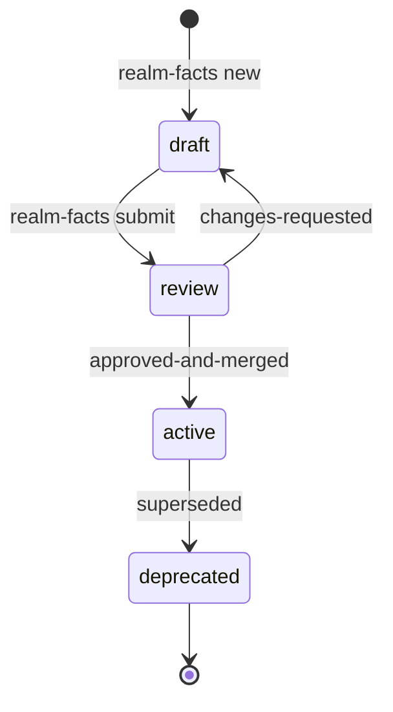

# Realm Facts — Team Workflow

Organization-wide knowledge facts: GitLab review, Microsoft Teams notifications, agent-ingestable.

## Overview

```
Setup → Create Fact → Submit MR → Teams Notify → Review → Approve → Merge → Team Sync → Agent Ingest
```

Central repo: `realm-facts` on GitLab. Product repos hold a pointer in `.realm/realm-state.json`.

## Roles

| Role | Actions |
|---|---|
| **Author** | Create facts, submit MRs, respond to review feedback |
| **Reviewer** | Review MRs, approve or request changes |
| **Team member** | Pull synced facts, query via `/realm-facts recall`, ingest for agents |
| **Agent** | Consume compressed fact bundles via `/realm-facts ingest` |

## Phase 1 — Setup (once per org)

### 1.1 Create central GitLab repo

```bash
# Create org/realm-facts on GitLab
git clone git@gitlab.example.com:org/realm-facts.git
cd realm-facts

# Bootstrap layout
python3 /path/to/realm/skills/realm-facts/scripts/facts.py init --facts-root .
git add . && git commit -m "init realm-facts" && git push
```

### 1.2 Configure MCP (Cursor)

Copy [mcp/cursor-mcp.example.json](../mcp/cursor-mcp.example.json) to `.cursor/mcp.json`.
Set env vars: `REALM_GITLAB_TOKEN`, `REALM_GITLAB_API_URL`, `REALM_TEAMS_WEBHOOK`.

### 1.3 Connect product repos

In each product repo:

```bash
/realm-facts forge
# Provide path to local realm-facts clone
# Or: /realm-facts forge --facts-url https://gitlab.example.com/org/realm-facts.git
```

Writes to `.realm/realm-state.json`:

```json
"factsRepo": {
  "url": "https://gitlab.example.com/org/realm-facts.git",
  "localPath": "/path/to/realm-facts",
  "branch": "main",
  "lastSync": null
}
```

## Phase 2 — Create a Fact

```bash
/realm-facts new platform jwt-token-rotation
```

Skill interviews the user for:
- Compressed summary (1-2 sentences, ≤400 chars)
- Evidence (Confluence links, repo refs)
- Owners and reviewers
- Tags

`scripts/facts.py new` writes and validates the file; the interview never hand-writes it.

Output: `facts/platform/jwt-token-rotation/index.md` (status: `draft`)

Optional:
- Add prose in `## Context` / `## Evidence` directly in the fact file
- Link related facts: `/realm-facts link jwt-token-rotation --related session-refresh-policy`

## Phase 3 — Submit for Review

```bash
/realm-facts submit jwt-token-rotation
```

Pipeline:
1. `facts.py validate --mr-ready` — schema check
2. Fact status → `review` (`facts.py set-status`)
3. Git branch `fact/jwt-token-rotation` → push
4. GitLab MR created via MCP (manual fallback if MCP unavailable)
5. Microsoft Teams notification to org channel

Teams message:
```
📋 New fact review: JWT Token Rotation
Author: @alice | Reviewers: @bob
MR: https://gitlab.../merge_requests/42
Summary: JWT 15min expiry. Refresh via silent iframe.
```

## Phase 4 — Review and Approve

Reviewer:

```bash
/realm-facts review jwt-token-rotation
/realm-facts review jwt-token-rotation --approve
# or
/realm-facts review jwt-token-rotation --request-changes "missing Confluence evidence"
```

Review checklist:
- [ ] Schema valid
- [ ] Compressed summary agent-useful
- [ ] Evidence links present
- [ ] No duplicate id
- [ ] Links consistent

On approval:
- MR merged on GitLab
- Fact status → `active`
- Teams: "✅ Fact approved — team pull latest"

On changes requested:
- MR comment posted
- Teams notifies author

## Phase 5 — Team Sync

After merge, team members:

```bash
/realm-facts sync
```

Pulls latest from `main`, refreshes `facts-index.json`, updates `lastSync`.

## Phase 6 — Query and Agent Ingest

### Query facts

```bash
/realm-facts recall jwt                          # keyword search across id/title/compressed/tags
/realm-facts recall jwt --domain platform --tag auth --status active
/realm-facts recall jwt-token-rotation --deps    # expand dependency compresses
```

Reads `facts-index.json` only — never a live scan of the fact tree. If a fact you know exists
doesn't show up, run `/realm-facts sync` first.

### Hand off to coding agent

```bash
/realm-facts ingest jwt-token-rotation --bundle impl
```

Produces compact bundle for implementation agents:

```
FACT_BUNDLE:
  id: jwt-token-rotation
  compressed: JWT 15min expiry. Refresh via silent iframe.
  deps: [...]
  repo_refs: [...]
  drift_policy: live code wins; facts = intent
```

Paste bundle into agent prompt or use as session context.

## Fact Lifecycle



## Repository Structure

```
realm-facts/
├── facts/<domain>/<fact-id>/index.md
├── decisions/ADR-*.md
├── references/
├── scripts/facts.py      # vendored by `facts.py init` — lets this repo's own CI validate/index
├── facts-index.json      # generated
├── facts-graph.json      # generated
└── .realm/facts-state.json
```

## GitLab CI (recommended)

```yaml
validate-facts:
  script:
    - python3 scripts/facts.py validate --facts-root . --mr-ready
    - python3 scripts/facts.py index --facts-root .
  rules:
    - if: $CI_PIPELINE_SOURCE == "merge_request_event"
```

## Skills Reference

One routed skill, `realm-facts`, with 8 subcommands. All mechanical work (parsing, validation,
indexing, status transitions, the `factsRepo` pointer) runs through
`skills/realm-facts/scripts/facts.py` — see `skills/realm-facts/SKILL.md` for the ground rules.

| Subcommand | Purpose |
|---|---|
| `/realm-facts forge` | Connect this repo to a central facts repo |
| `/realm-facts new <domain> <id>` | Interactively author a new fact |
| `/realm-facts link <id> --related <id2>` | Link facts together |
| `/realm-facts submit <id>` | Validate mr-ready, GitLab MR + Teams notification |
| `/realm-facts review <id>` | Reviewer approve/request changes |
| `/realm-facts sync` | Pull latest approved facts, reindex |
| `/realm-facts recall <query>` | Query facts (index-backed) |
| `/realm-facts ingest <id>` | FACT_BUNDLE for other agents |

## Operating Rules

1. **One source of truth** — central `realm-facts` repo on GitLab `main`
2. **No direct push to main** — all facts via MR review
3. **Compressed required** — every active fact must have agent-ingestable `## Compressed`
4. **Owners assigned** — every fact has `@owner` responsible for accuracy
5. **Sync cadence** — run `/realm-facts sync` at session start or after Teams approval notice
6. **Drift policy** — live code wins for behavior; facts explain intent; flag `FACT DRIFT`

## Troubleshooting

| Issue | Fix |
|---|---|
| No facts repo connected | `/realm-facts forge` |
| MR validation fails | Fix errors from `facts.py validate --facts-root . --mr-ready` |
| Teams notification skipped | Set `REALM_TEAMS_WEBHOOK` |
| GitLab MCP unavailable | Create MR manually, paste URL to skill |
| Stale local facts | `/realm-facts sync` (always reindexes) |
